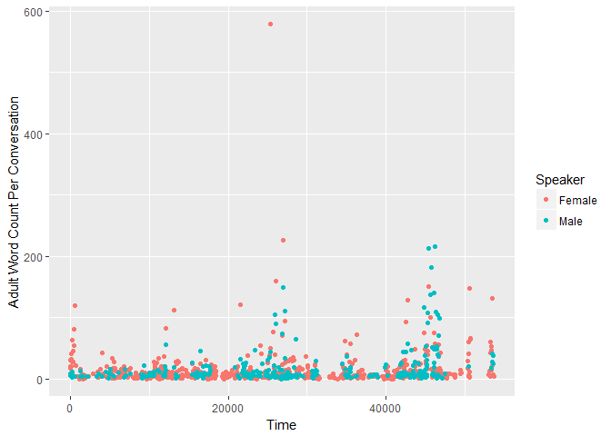
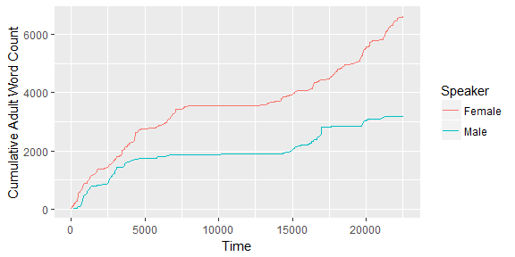

<!-- README.md is generated from README.Rmd. Please edit that file -->
rlena
=====

[](http://www.repostatus.org/#concept)

An R package for extracting data from LENA .its files.

Proof of Concept
----------------

There are just a few functions at the moment:

-   `read_its_file()` loads the ITS file in R as an XML document.
-   `gather_ava_info()` extracts the AVA (Automatic Vocalization Assessment) scores into a dataframe.
-   `gather_child_info()` extracts the child information.
-   `gather_conversations()` collects the attributes of every `<Conversation>` node into a dataframe.

``` r
library(rlena)
library(dplyr, warn.conflicts = FALSE)

# Download an example ITS file for demo
url <- "https://raw.githubusercontent.com/gpretzer/lena-its-tools/master/Example/e20160420_165405_010572.its"
tmp <- tempfile()
download.file(url, tmp)
lena_log <- read_its_file(tmp) 

## local file used for testing
# lena_log <- read_its_file("tests/testthat/data/file-for-testing.its") 
```

Examples of simple information extraction.

``` r
gather_ava_info(lena_log)
#> # A tibble: 1 x 5
#>                  ITSFile AVA_Raw AVA_Stnd AVA_EstMLU AVA_EstDevAge
#>                    <chr>   <dbl>    <dbl>      <chr>         <chr>
#> 1 20160420_165405_010572   0.715  110.724        ORL           P5M
gather_child_info(lena_log)
#> # A tibble: 1 x 6
#>                  ITSFile  Birthdate Gender ChronologicalAge AVAModelAge
#>                    <chr>     <date>  <chr>            <chr>       <chr>
#> 1 20160420_165405_010572 2015-11-19      M              P4M         P4M
#> # ... with 1 more variables: VCVModelAge <chr>
```

We can extract a dataframe of conversations and play with the data.

``` r
conversations <- gather_conversations(lena_log)
conversations
#> # A tibble: 655 x 41
#>                   ITSFile   num  type average_dB peak_dB turnTaking
#>                     <chr> <int> <chr>      <dbl>   <dbl>      <int>
#>  1 20160420_165405_010572     1   AMF     -26.16  -13.00          0
#>  2 20160420_165405_010572     2   AMF     -26.57  -14.80          0
#>  3 20160420_165405_010572     3  AICF     -18.10   -6.84          2
#>  4 20160420_165405_010572     4 AIOCF     -15.92   -6.65          0
#>  5 20160420_165405_010572     5   AMF     -25.37  -10.55          0
#>  6 20160420_165405_010572     6  AICF     -26.77  -10.15          1
#>  7 20160420_165405_010572     7    CM     -18.12   -6.75          0
#>  8 20160420_165405_010572     8  AICF     -19.69   -9.72          1
#>  9 20160420_165405_010572     9   AMF     -24.60   -9.37          0
#> 10 20160420_165405_010572    10   AMF     -34.84  -26.24          0
#> # ... with 645 more rows, and 35 more variables:
#> #   femaleAdultInitiation <int>, maleAdultInitiation <int>,
#> #   childResponse <int>, childInitiation <int>, femaleAdultResponse <int>,
#> #   maleAdultResponse <int>, adultWordCnt <dbl>, femaleAdultWordCnt <dbl>,
#> #   maleAdultWordCnt <dbl>, femaleAdultUttCnt <int>,
#> #   maleAdultUttCnt <int>, femaleAdultUttLen <chr>, maleAdultUttLen <chr>,
#> #   femaleAdultNonSpeechLen <chr>, maleAdultNonSpeechLen <chr>,
#> #   childUttCnt <int>, childUttLen <chr>, childCryVfxLen <chr>, TVF <chr>,
#> #   FAN <chr>, OLN <chr>, SIL <chr>, NOF <chr>, CXF <chr>, OLF <chr>,
#> #   CHF <chr>, MAF <chr>, TVN <chr>, NON <chr>, CXN <chr>, CHN <chr>,
#> #   MAN <chr>, FAF <chr>, startTime <dbl>, endTime <dbl>

# Create long data-frame of word counts
library("tidyr")
word_counts <- conversations %>% 
  select(num, Time = startTime, 
         Female = femaleAdultWordCnt, Male = maleAdultWordCnt) %>% 
  gather(Speaker, Count, -num, -Time) %>% 
  filter(Count != 0) %>% 
  group_by(Speaker) %>% 
  arrange(num) %>% 
  mutate(Accumulated = cumsum(Count)) %>% 
  ungroup()

library("ggplot2")
ggplot(word_counts) + 
  aes(x = Time, y = Count, color = Speaker) + 
  geom_point() + 
  ylab("Adult Word Count Per Conversation")
```



``` r

ggplot(word_counts) + 
  aes(x = Time, y = Accumulated, color = Speaker) + 
  geom_line() + 
  ylab("Cumulative Adult Word Count")
```


