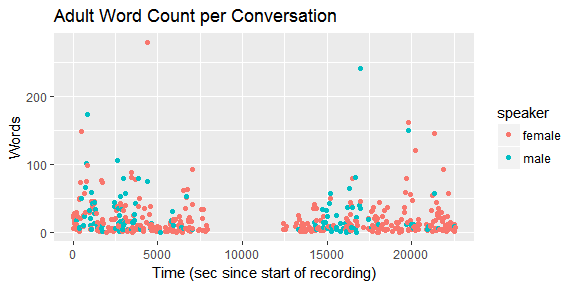
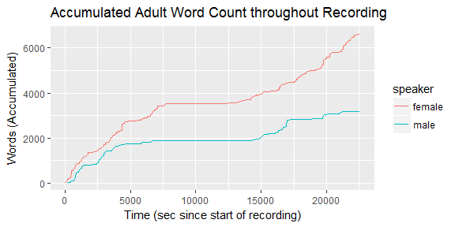
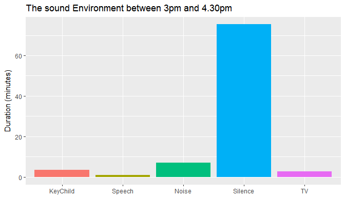

<!-- README.md is generated from README.Rmd. Please edit that file -->
rlena
=====

[](http://www.repostatus.org/#wip) [](https://travis-ci.org/Teebusch/rlena) [](https://coveralls.io/github/Teebusch/rlena?branch=master)

Overview
--------

The rlena package makes it easy to work with LENA `.its` files in R.

The *Language Environment ANalysis (LENA)* system produces automatic annotations for audio recordings. Its annotations can be exported as `.its` files, that contain an `xml` structure. The rlena package helps with importing and preparing `.its` files for further anlysis in R.

The `read_its_file()` fuction takes the path to an `.its` file and returns an XML object. All other functions work with this object to extract information. They return tidy data frames that can easily be manipulated with the usual tools from the tidyverse:

-   `gather_recordings()` - Returns all `<Recording>` nodes
-   `gather_blocks()` - Returns all `<Conversation>` and `<Pause>` nodes
-   `gather_conversations()`- Returns all `<Conversation>` nodes
-   `gather_pauses()` - Returns all `<Pause>` nodes
-   `gather_segments()` - Returns all `<Segment>` nodes
-   `gather_ava_info()` - Returns AVA (Automatic Vocalization Assessment) info
-   `gather_child_info()` - Returns child info (e.g. birth data, age, gender)

:warning: ***Warning:** This package is early work in progress and subject to potentially code-breaking change.*

Installation
------------

``` r
# rlena is not (yet) available on CRAN, but you can install the developmental 
# version from GitHub (requires devtools):
if(!require(devtools) install.packages("devtools")
devtools::install_github("HomeBankCode/rlena", dependencies = TRUE)
```

Usage
-----

-   Load an `.its` file. For this example we download a file from [HomeBankCode/lena-its-tools](https://github.com/HomeBankCode/lena-its-tools).

``` r
library(rlena)
library(dplyr, warn.conflicts = FALSE)

# Download the example ITS file
url <- "https://cdn.rawgit.com/HomeBankCode/lena-its-tools/master/Example/e20160420_165405_010572.its"
tmp <- tempfile()
download.file(url, tmp)
its <- read_its_file(tmp)
```

-   Extract child info and results of the Automatic Vocalization Assessment (an index of the child's language development).

``` r
gather_child_info(its)
#> # A tibble: 1 x 6
#>                    itsId  Birthdate Gender ChronologicalAge AVAModelAge
#>                    <chr>     <date>  <chr>            <chr>       <chr>
#> 1 20160420_165405_010572 2015-11-19      M              P4M         P4M
#> # ... with 1 more variables: VCVModelAge <chr>
gather_ava_info(its)
#> # A tibble: 1 x 5
#>                    itsId AVA_Raw AVA_Stnd AVA_EstMLU AVA_EstDevAge
#>                    <chr>   <dbl>    <dbl>      <chr>         <chr>
#> 1 20160420_165405_010572   0.715  110.724        ORL           P5M
```

-   Extract the recording information.

``` r
# Each row corresponds to an uninterrupted recording. There is a long pause 
# inbetween the two recordings. This means, that the LENA recorder was paused.
(recordings <- gather_recordings(its))
#> # A tibble: 2 x 9
#>   recId startTime  endTime      startClockTime        endClockTime
#>   <int>     <dbl>    <dbl>              <dttm>              <dttm>
#> 1     1      0.00  4037.04 2016-04-02 17:20:30 2016-04-02 18:27:47
#> 2     2   4037.04 22575.05 2016-04-02 21:48:07 2016-04-03 02:57:05
#> # ... with 4 more variables: itsId <chr>, timeZone <chr>,
#> #   startClockTimeLocal <dttm>, endClockTimeLocal <dttm>
```

-   Extract all conversations.

``` r
# Each row of the returned data frame corresponds to
# one conversation node in the `.its` file. The columns contain the node's
# attributes, such as the number of adult words and child vocalizations.
conversations <- gather_conversations(its)
conversations
#> # A tibble: 655 x 48
#>    recId blkId blkTypeId      blkType startTime endTime
#>    <int> <int>     <int>        <chr>     <dbl>   <dbl>
#>  1     1     2         1 Conversation     12.27   15.81
#>  2     1     4         2 Conversation     21.18   27.82
#>  3     1     6         3 Conversation     34.20   49.98
#>  4     1     8         4 Conversation     71.69   79.84
#>  5     1    10         5 Conversation     93.53  100.85
#>  6     1    12         6 Conversation    110.91  124.47
#>  7     1    14         7 Conversation    132.32  139.73
#>  8     1    16         8 Conversation    150.82  161.87
#>  9     1    18         9 Conversation    176.87  192.18
#> 10     1    20        10 Conversation    198.31  199.25
#> # ... with 645 more rows, and 42 more variables: startClockTime <dttm>,
#> #   endClockTime <dttm>, startClockTimeLocal <dttm>,
#> #   endClockTimeLocal <dttm>, itsId <chr>, type <chr>, average_dB <dbl>,
#> #   peak_dB <dbl>, turnTaking <int>, femaleAdultInitiation <int>,
#> #   maleAdultInitiation <int>, childResponse <int>, childInitiation <int>,
#> #   femaleAdultResponse <int>, maleAdultResponse <int>,
#> #   adultWordCnt <dbl>, femaleAdultWordCnt <dbl>, maleAdultWordCnt <dbl>,
#> #   femaleAdultUttCnt <int>, maleAdultUttCnt <int>,
#> #   femaleAdultUttLen <dbl>, maleAdultUttLen <dbl>,
#> #   femaleAdultNonSpeechLen <dbl>, maleAdultNonSpeechLen <dbl>,
#> #   childUttCnt <int>, childUttLen <dbl>, childCryVfxLen <dbl>, TVF <dbl>,
#> #   FAN <dbl>, OLN <dbl>, SIL <dbl>, NOF <dbl>, CXF <dbl>, OLF <dbl>,
#> #   CHF <dbl>, MAF <dbl>, TVN <dbl>, NON <dbl>, CXN <dbl>, CHN <dbl>,
#> #   MAN <dbl>, FAF <dbl>
```

-   Plot male and female adult word counts.

``` r
library(tidyr)
library(ggplot2)

# Create long data-frame of word counts
word_counts <- conversations %>% 
  select(conversation_nr = blkTypeId,
         time = startClockTimeLocal,
         female = femaleAdultWordCnt, 
         male = maleAdultWordCnt) %>% 
  gather(key = speaker, value = count, female, male) %>% 
  filter(count != 0)

# Add acumulated word count
word_counts <- word_counts %>%
  group_by(speaker) %>% 
  arrange(conversation_nr) %>%
  mutate(count_acc = cumsum(count))

# Plot word counts per conversations
word_counts %>%
  ggplot(aes(conversation_nr, count, color = speaker)) + 
    geom_point() + 
    labs(title = "Adult Word Count per Conversation",
         x = "Conversation Number",
         y = "Words")
```



``` r
# Plot accumulating word count over time
word_counts %>%
  ggplot(aes(time, y = count_acc, color = speaker)) + 
    geom_rect(data = recordings, inherit.aes = FALSE,
              aes(xmin = startClockTimeLocal, xmax = endClockTimeLocal, 
                  ymin=0, ymax = max(word_counts$count_acc), group = recId,
                  fill = "recorder on"), alpha=0.2) + 
    scale_fill_manual(NULL, values = 'skyblue')  +
    geom_line() + 
    labs(title = "Accumulated Adult Word Count throughout Recording",
         x = "Time",
         y = "Words (Accumulated)")
```



-   What happened between 3pm and 4.30pm? We can have a closer look at the segments to see what happened.

``` r
library(lubridate)
#> 
#> Attaching package: 'lubridate'
#> The following object is masked from 'package:base':
#> 
#>     date

# extract segments
segments <- gather_segments(its) %>% 
  filter(startClockTimeLocal >= ymd_hms("2016-04-02 15:00:00"),
         startClockTimeLocal <= ymd_hms("2016-04-02 16:30:00"))

segments 
#> # A tibble: 837 x 55
#>    recId blkId blkTypeId segId blkType  spkr startTime endTime
#>    <int> <int>     <int> <int>   <chr> <chr>     <dbl>   <dbl>
#>  1     2   592       297  5842   Pause   CHF   8382.63 8383.43
#>  2     2   592       297  5843   Pause   SIL   8383.43 8384.40
#>  3     2   592       297  5844   Pause   SIL   8384.40 8385.40
#>  4     2   592       297  5845   Pause   SIL   8385.40 8386.36
#>  5     2   592       297  5846   Pause   NOF   8386.36 8387.99
#>  6     2   592       297  5847   Pause   SIL   8387.99 8390.32
#>  7     2   592       297  5848   Pause   TVF   8390.32 8392.11
#>  8     2   592       297  5849   Pause   NOF   8392.11 8392.98
#>  9     2   592       297  5850   Pause   SIL   8392.98 8393.78
#> 10     2   592       297  5851   Pause   NOF   8393.78 8394.59
#> # ... with 827 more rows, and 47 more variables: startClockTime <dttm>,
#> #   endClockTime <dttm>, startClockTimeLocal <dttm>,
#> #   endClockTimeLocal <dttm>, itsId <chr>, average_dB <dbl>,
#> #   peak_dB <dbl>, recordingInfo <chr>, conversationInfo <chr>,
#> #   convStatus <chr>, convCount <int>, convTurnCount <int>,
#> #   convResponseCount <int>, convType <chr>, convTurnType <chr>,
#> #   convFloorType <chr>, femaleAdultWordCnt <dbl>,
#> #   femaleAdultNonSpeechLen <dbl>, femaleAdultUttCnt <int>,
#> #   femaleAdultUttLen <dbl>, childUttCnt <int>, childUttLen <dbl>,
#> #   startUtt1 <chr>, endUtt1 <chr>, childCryVfxLen <dbl>, startVfx1 <dbl>,
#> #   endVfx1 <dbl>, startCry1 <chr>, endCry1 <chr>, maleAdultWordCnt <dbl>,
#> #   maleAdultNonSpeechLen <dbl>, maleAdultUttCnt <int>,
#> #   maleAdultUttLen <dbl>, startUtt2 <chr>, endUtt2 <chr>,
#> #   startUtt3 <chr>, endUtt3 <chr>, startUtt4 <chr>, endUtt4 <chr>,
#> #   startUtt5 <chr>, endUtt5 <chr>, startCry2 <chr>, endCry2 <chr>,
#> #   startVfx2 <chr>, endVfx2 <chr>, startUtt6 <chr>, endUtt6 <chr>
```

``` r
segments %>%
  mutate(duration = endTime - startTime,
         Label = forcats::fct_collapse(
           spkr,
           KeyChild = c("CHN", "CHF"),
           Speech   = c("FAN", "MAN", "CXN", "FAF", "MAF", "CXF"),
           TV       = c("TVN", "TVF"),
           Noise    = c("NOF", "NON", "OLF", "OLN"),
           Silence  = c("SIL")
         ))  %>%
  group_by(Label) %>%
  summarize(duration = sum(duration)) %>%
  ggplot(aes(Label, duration / 60, fill = Label)) + 
    geom_col(show.legend = FALSE) +
    labs(title = "The sound Environment between 3pm and 4.30pm",
         y = "Duration (minutes)", x = NULL)
```


